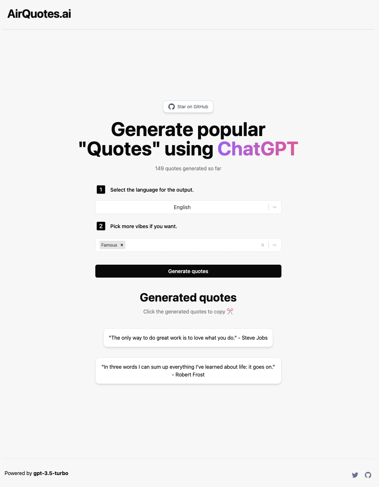

# [airquotes.ai](https://www.airquotes.ai)

This project generates popular quotes using AI.

[](https://www.airquotes.ai)

## How it works

The project utilizes [Vercel Edge functions](https://vercel.com/features/edge-functions) in combination with the [ChatGPT API](https://openai.com/api/), incorporating streaming functionality. It generates a prompt based on user input and form, transmits it to the ChatGPT API through a Vercel Edge function, and subsequently streams the resulting response back to the application.

## Running Locally

After cloning the repo, go to [OpenAI](https://beta.openai.com/account/api-keys) to make an account and put your API key in a file called `.env`.

Then, run the application in the command line and it will be available at `http://localhost:3000`.

```bash
pnpm run dev
```
